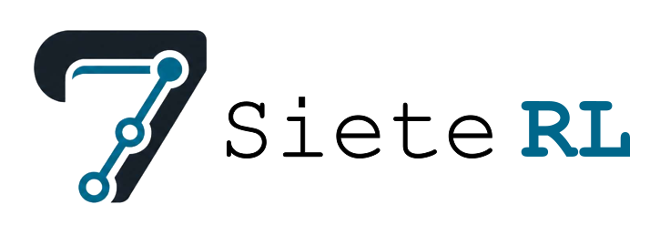
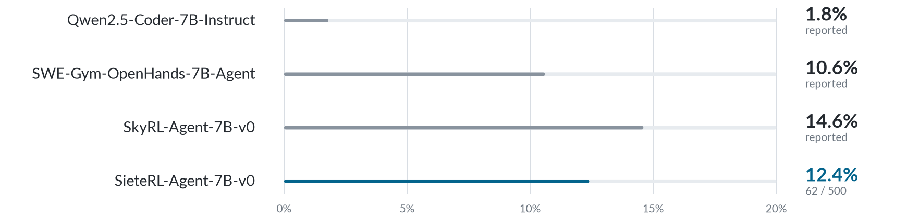

<p align="center">
  <picture>
    <source media="(prefers-color-scheme: dark)" srcset="docs/assets/logo-dark.png">
    <source media="(prefers-color-scheme: light)" srcset="docs/assets/logo-light.png">
    
  </picture>
</p>

<p align="center">EN | <a href="README_CN.md">中文</a></p>

<p align="center"><i>Reinforcement learning for software-engineering agents with verifiable rewards.</i></p>

<p align="center">
  
  
  <a href="https://github.com/Sevendogs077/siete-rl/actions/workflows/ci.yml"></a>
  <a href="LICENSE"></a>
</p>

SieteRL trains software-engineering agents to solve repository-level tasks through multi-turn interaction. It starts from SWE-Gym OpenHands-7B-Agent, runs each rollout in an isolated container, and evaluates trained checkpoints on SWE-bench Verified.

> [!NOTE]
> SieteRL is under active development. Project structure, APIs, and experimental configurations may change.

## Results

<p align="center">
  <picture>
    <source media="(prefers-color-scheme: dark)" srcset="docs/assets/results-chart-dark.png">
    <source media="(prefers-color-scheme: light)" srcset="docs/assets/results-chart-light.png">
    
  </picture>
</p>

Full results and run details: [docs/results.md](docs/results.md).

## Details

- **Layered Rewards** — A resolved patch receives `1.0`; an unresolved patch receives `0.20p²` only when it applies cleanly and every P2P test passes, where `p` is its F2P pass rate.
- **All-zero Group Calibration** — A fixed `0.1` reference reward preserves a training signal when every rollout in a group fails.
- **Sign-aware Process Mask** — Malformed calls and the third or later identical Bash/editor action lose positive credit but retain negative credit.
- **Failure-aware Rollout Handling** — Infrastructure failures affect neither the group mean nor the gradient; physical truncation masks only the final incomplete turn, while other abnormal exits still verify their final patches.
- **Optimization Improvements** — `0.16/0.24` asymmetric clipping and token-level vLLM importance correction stabilize policy updates over 32K tool-use trajectories.

## Reproduction

Training uses four GPUs by default, and evaluation uses GPU 0. See the [setup guide](docs/setup.md) for two-GPU training and environment preparation.

```bash
uv sync
bash scripts/prepare.sh
bash scripts/qualify.sh
bash scripts/stage1.sh
bash scripts/stage2.sh outputs/<stage1-run-id>
bash scripts/eval.sh outputs/<stage2-run-id>
```

> [!WARNING]
> The agent executes model-generated code. Only connect a dedicated, non-production Docker daemon.

## Project layout

```text
src/siete_rl/   training, environment, verification, evaluation, and run recording
configs/        current experiment configurations
scripts/        entry points for asset preparation, qualification, training, and evaluation
tests/          unit tests and explicitly enabled integration tests
docs/           experiment documentation and notes
```

## References

<p align="center">
  <a href="https://github.com/linkedin/Liger-Kernel">Liger Kernel</a> ·
  <a href="https://github.com/OpenHands/OpenHands">OpenHands</a> ·
  <a href="https://github.com/NovaSky-AI/SkyRL">SkyRL</a> ·
  <a href="https://huggingface.co/datasets/SumanthRH/SWE-Gym">SumanthRH/SWE-Gym</a> ·
  <a href="https://github.com/SWE-bench/SWE-bench">SWE-bench</a> ·
  <a href="https://github.com/SWE-Gym/SWE-Gym">SWE-Gym</a> ·
  <a href="https://huggingface.co/NovaSky-AI/SWE-Gym-OpenHands-7B-Agent">SWE-Gym OpenHands-7B-Agent</a> ·
  <a href="https://github.com/huggingface/trl">TRL</a>
</p>

## License

The code in this repository is released under the [MIT License](LICENSE).
